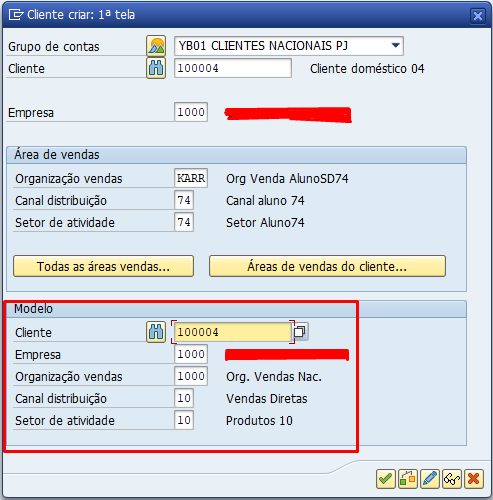
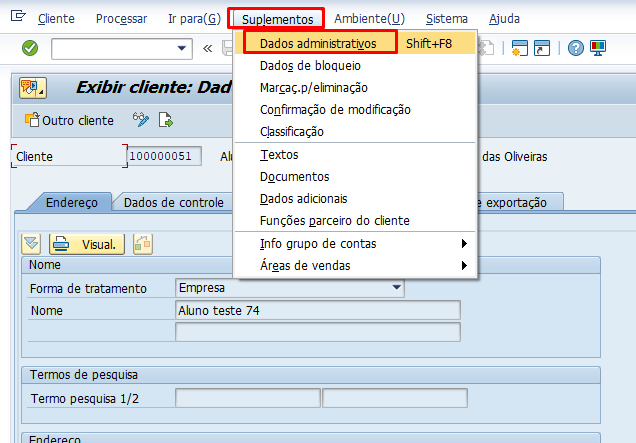

# Pontos importantes sobre Cliente

## Transações

- **XD01:** Criar cliente
- **XD02:** Editar o cadastro 
- **XD03:** Visualiza o cadastro 

 
## Tabelas

- **KNA1:** Verificar tabela de dados gerais de cliente
- **KNB1:** Dados do cliente por empresa
- **KNVV:** Dados do cliente por área de vendas

## Definindo grupo de contas

1. Acesse a transação **SPRO**;
2. Siga o caminho abaixo:

    - *Logística geral* **>** *Parceiro de negócios* **>** *Clientes* **>** *Controle* **>** *Definir grupos de contas e seleção de campos clientes*;

3. Clica em *Entradas novas*; 
4. Preenche os campos mandatórios e salva na request.

## Para visualizar o grupo de contas do cliente

1. Acesse a transação **XD03**;
2. Insira o código do cliente;
3. Na barra de menu, escolha **Suplementos** > **Dados Administrativos**.

## Alguns anexos de Imagens 

- Expandindo um cliente
**OBS:** É só preencher o **modelo** que o cliente será copiado   

   

- Visualização do grupo de contas de um cliente   

