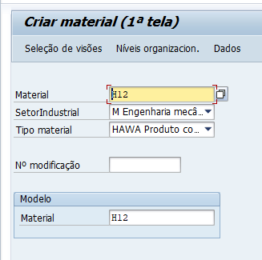
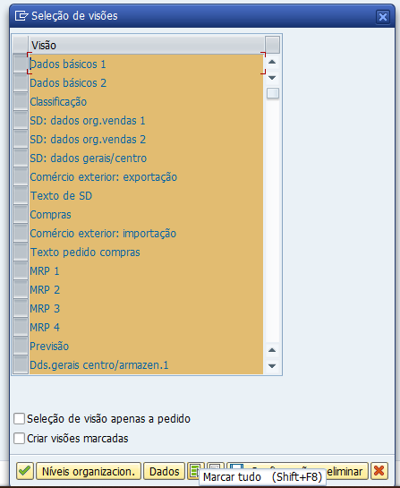
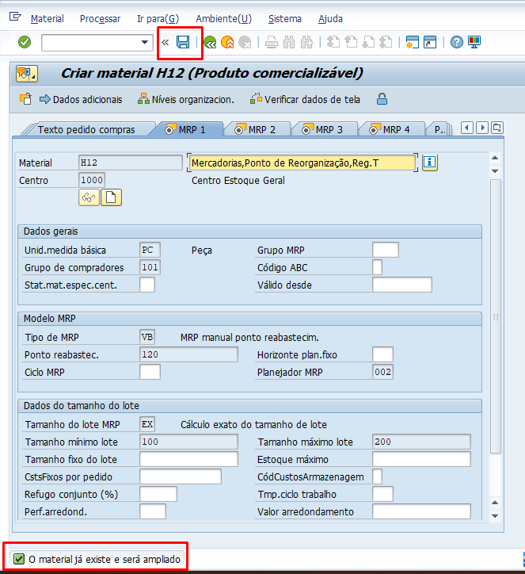
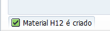

# Pontos importantes sobre Material

OBS: Cadastro de Material é de MM, porém existem questões dentro do material que são estritamente de SD, por isso eu trouxe esse dado mestre.

## Transações

- **MM01:** Criar o material
- **MM02:** Editar o material 
- **MM03:** Visualizar o material
- **MMBE:** Visualizar o status de estoque de materiais em um depósito específico 

## Tabelas

- **MARA:** Verificar os dados gerais do material
- **MVKE:** Ver se o material esta criado na organização e no canal
- **MARC:** Ver se o material esta criado para meu centro 
- **MARD:** Para qual combinação está o material: depósito e centro

## Expandindo um material já criado para nossa organização de vendas

1. Acesse a transação **MM01** e preenche os campos, como na imagem abaixo;   

   

2. Seleciona todas as visões, como na imagem abaixo;   

   

3. Preenche sua organização de venda e a do modelo, como na imagem abaixo;   

   

4. Agora é só salvar, como na imagem abaixo;   

   

5. Aparecerá no fim da página essa mensagem.   

