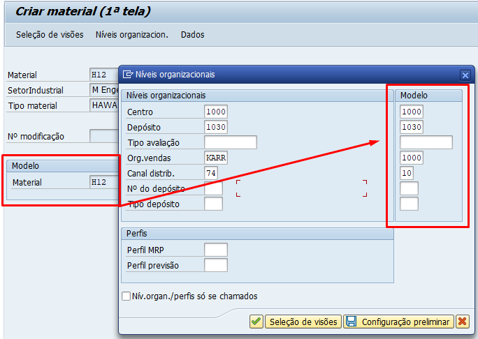
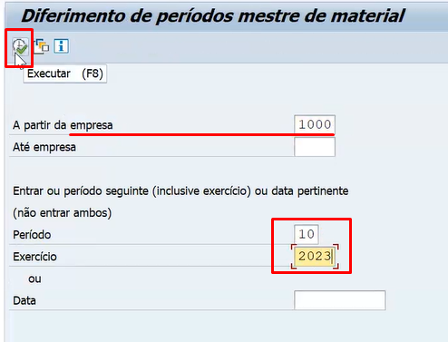

# Pontos importantes sobre Material

OBS: Cadastro de Material é de MM, porém existem questões dentro do material que SD precisa saber, por isso eu trouxe esse dado mestre.

## Transações

- **MM01:** Criar o material
- **MM02:** Editar o material 
- **MM03:** Visualizar o material
- **MMBE:** Visualizar o estoque de materiais em um depósito específico
- **MB1C:** Registrar entrada e saída de mercadoria. 
OBS: "561" é o movimento de entrada de estoque e "562" é o movimento de retirada do estoque
- **MIGO:** Transação no S4/HANNA para registro de mercadoria
OBS: **MMBE:** e **MB1C:** ficaram obsoletas
- **MMPV:** Abrir registro para movimentação de mercadoria

## Tabelas

- **MARA:** Verificar os dados gerais do material
- **MVKE:** Ver se o material esta criado na organização e no canal
- **MARC:** Ver se o material esta criado para meu centro 
- **MARD:** Para qual combinação está o material: depósito e centro

## Expandindo um material já criado para nossa organização de vendas

1. Acesse a transação **MM01** e preenche os campos mandatórios;   

2. Seleciona todas as visões, como na imagem abaixo;     

3. Preenche sua organização de venda e a do modelo, como na imagem abaixo;   

   

4. Agora é só salvar que aparecerá a mensagem: *Material é criado*, significa que foi ampliado.

### Anexos de imagens

- Print da transação **MMPV**, uma abertura de registro para movimentação de mercadoria.   
OBS: É uma transação de MM, mas SD precisa conhecer também.   

