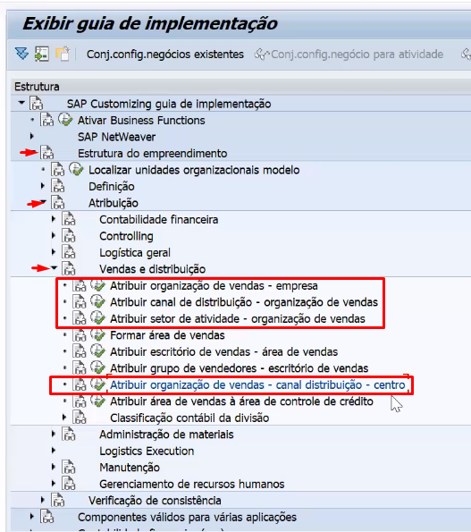

# Atribuições para formar a área de vendas

## Atribuir organização de vendas a empresa

1. Acesse a transação **SPRO**;
2. Siga o caminho abaixo:

    - *Estrutura do empreendimento* **>** *Atribuição* **>** *Vendas e distribuição* **>** *Atribuir organização de vendas - empresa*;

3. Procura sua organização de vendas e associa a empresa; 
4. Salva na request.

## Atribuir canal de distribuição a organização de vendas

1. Acesse a transação **SPRO**;
2. Siga o caminho abaixo:

    - *Estrutura do empreendimento* **>** *Atribuição* **>** *Vendas e distribuição* **>** *Atribuir canal de distribuição - organização de vendas*;

3. Clica em *Entradas novas* e seleciona as entradas; 
4. Salva na request.

## Atribuir setor de atividade a organização de vendas

1. Acesse a transação **SPRO**;
2. Siga o caminho abaixo:

    - *Estrutura do empreendimento* **>** *Atribuição* **>** *Vendas e distribuição* **>** *Atribuir setor de atividade - organização de vendas*;

3. Clica em *Entradas novas* e seleciona as entradas; 
4. Salva na request.

## Atribuir organização de vendas ao canal de distribuição e ao centro

1. Acesse a transação **SPRO**;
2. Siga o caminho abaixo:

    - *Estrutura do empreendimento* **>** *Atribuição* **>** *Vendas e distribuição* **>** *organização de vendas - canal de distribuição - centro*;

3. Clica em *Entradas novas* e seleciona as entradas;
4. Salva na request.

### Print da SPRO
  

