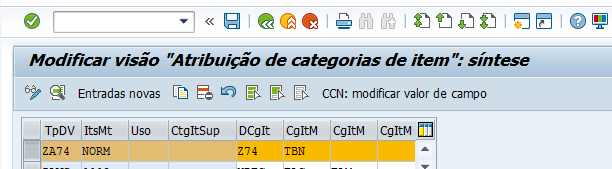

# Categoria de item

## Definindo nossa categoria de item 

1. Acesse a transação **SPRO**;
2. Siga o caminho abaixo:

    - *Venda e distribuição* **>** *Venda* **>** *Documentos de vendas* **>** *item do documento de vendas*;

3. Clica em *Definir categorias de item*;
4. Copia a categoria de item *TBN*, que é a standard e CÓPIA;
5. Muda o nome mandatório da categoria e salva na request.

# Atribuindo categorias de item

1. 1. Acesse a transação **SPRO**;
2. Siga o caminho abaixo:

    - *Venda e distribuição* **>** *Venda* **>** *Documentos de vendas* **>** *item do documento de vendas*;

3. Clica em *Atribuir categorias de item*;
4. Procura seu tipo de documento de venda e associa sua categoria de item a ele;
5. Salva na request.

- Abaixo print dessa atribuição:   

## Na ordem de venda, onde vejo a categoria de item ?   

   

## 