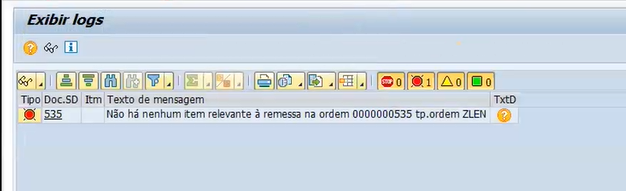
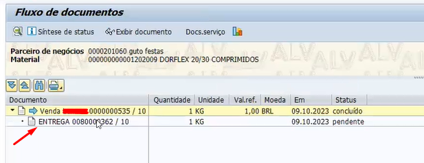

# Alguns erros que podem surgir nos processos de vendas

1. Erro ao fornecer a ordem, para gerar a remessa   

    

- Solução: O erro se dar pelo fato de você já ter criado uma remessa. Deve entrar na transação **VA02** e consultar o fluxo de documentos, como no print abaixo, a remessa já está criada.   

    