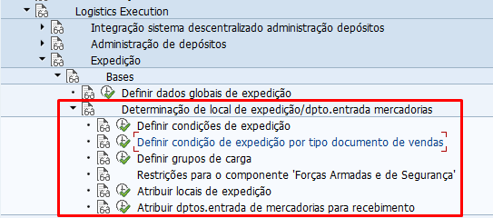
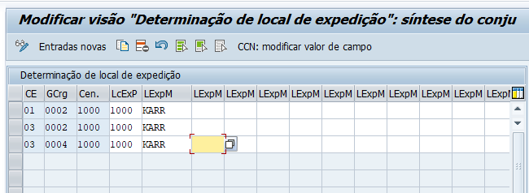

# Condição de expedição 

    - OBS: Parametro em que vai definir em qual local de expedição vai ser expedido a mercadoria

-  Abaixo print da **SPRO** onde customizamos tudo relacionado as condições de expedição.   

   

- Print da parte de *Atribuir locais de expedição*
OBS: Associação do *grupo de carregamento do material*, *condição de expedição do cliente* e *centro* com local de expedição   

