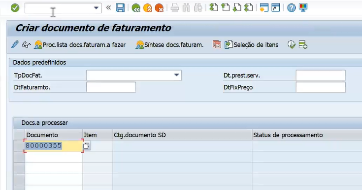
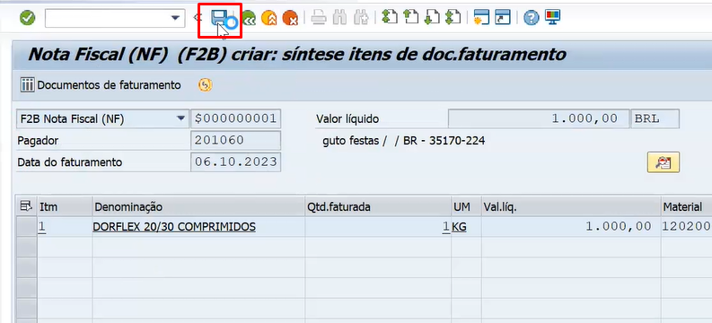
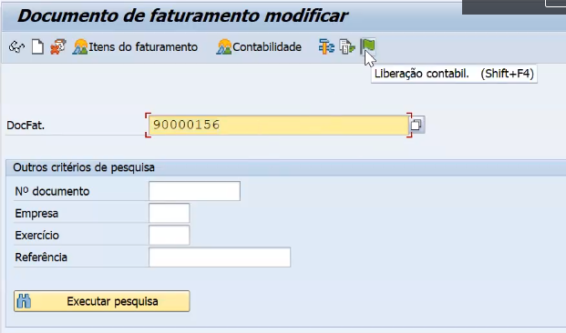
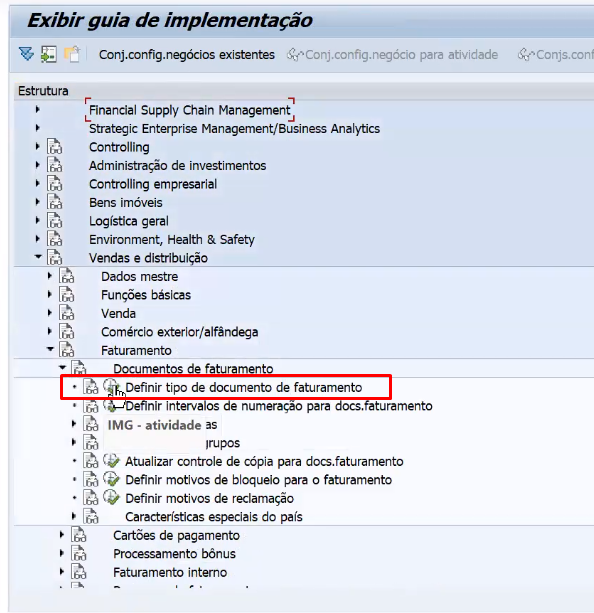

## Transações 

- **VF01:** Criar documento de faturamento
- **VF02:** Modifica faturamento
- **VF03:** Visualiza o faturamento

# Para gerar uma Nota fiscal 

- Coloca o número da remessa:   

- Só salvar e gera a nota fiscal:   

   

- Caso não gere um documento contábil na hora de gerar a fatura, pode gerar depois seguindo o caminho abaixo:

1. Acesse a transação **VF02**
2. Clique em *Liberação contábil*, como na imagem abaixo:   

   

## Fatura 

- Configurações na **SPRO** em relação a fatura. 

1. Acessa a **SPRO**
2. Siga o caminho abaixo:

    - *Venda e distribuição* **>** *Faturamento* **>** *Documentos de faturamento* **>** * Definir tipo de documento de faturameto*;

3. Clica em *Definir tipo de documento de faturameto*;   

 