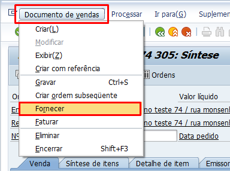

# Remessa

OBS: A criação da remessa pode estar sujeita à *Verificação de disponibilidade (ATP)*

## Transações 

- **VL01N:** Criar remessa
- **VL02N:** Modifica remessa
- **VL03N:** Visualiza a remessa

OBS: É mandatório o local de expedição e a ordem de venda para criação da remessa 

## Tabelas

- **LIKP:** Cabeçalho de remessa
- **LIPS:** Itens de remessa
 

## Criando remessa dentro da Ordem de Venda

1. Acessa a transação **VA02**;
2. Pesquisa sua ordem de venda;
3. Depois segue o caminho do print abaixo.   

   

##  Criando tipo de remessa

## Categoria de divisão de remessa

1. Acesse a transação **SPRO**;
2. Siga o caminho abaixo:

    - *Venda e distribuição* **>** *Venda* **>** *Documentos de vendas* **>** *Divisões de remessa*;

3. Clica em *Definir ctgs.divisão*;
4. Procura a divisão standard, que é a *CP* e CÓPIA;
5. Preenche os campos mandatórios e salva na request.

## Atribuir  categorias de divisão de remessa

1. Acesse a transação **SPRO**;
2. Siga o caminho abaixo:

    - *Venda e distribuição* **>** *Venda* **>** *Documentos de vendas* **>** *Divisões de remessa*;

3. Clica em *Atribuir categorias de divisões de remessa*;
4. Procura sua categoria de item e associa a sua categoria de divisão de remessa;
5. Salva na request.

