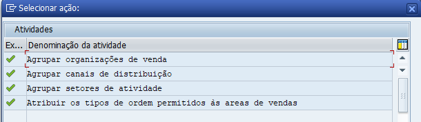

# Tipo de documento de vendas

## Customizações do Cabeçalho de Documento de Vendas

1. Caminho na **SPRO** 

    - *Venda e distribuição* **>** *Venda* **>** *Documentos de vendas* **>** *Cabeçalho de documento de vendas*;
    
 2. Faz as customizações que desejar.

## Criar tipo de documento de vendas 

1. Acesse a transação **SPRO**;
2. Siga o caminho abaixo:

    - *Venda e distribuição* **>** *Venda* **>** *Documentos de vendas* **>** *Cabeçalho de documento de vendas* **>** *Definir tipos de doc.vendas*;

3. Procura pela ORB, que é o tipo de ordem mais utilizada, e CÓPIA;
4. Preenche os campos mandatórios e salva na request.

## Atribuir área de vendas ao tipo de documento de vendas

1. Acesse a transação **SPRO**;
2. Siga o caminho abaixo:

    - *Venda e distribuição* **>** *Venda* **>** *Documentos de vendas* **>** *Cabeçalho de documento de vendas* **>** *Atribuir área de vendas a tipos de documento de vendas*;

3. Clica em *Atribuir os tipos de ordem permitidos às areas de vendas*; 
4. Clica em *Entradas novas*;
4. Preenche os campos mandatórios e salva na request.

    - **OBS:** Lembrando que antes de atibuir você deve fazer os agrupamentos que estão acima do *Atribuir área de vendas a tipos de documento de vendas*, como na imagem abaixo:   

       

